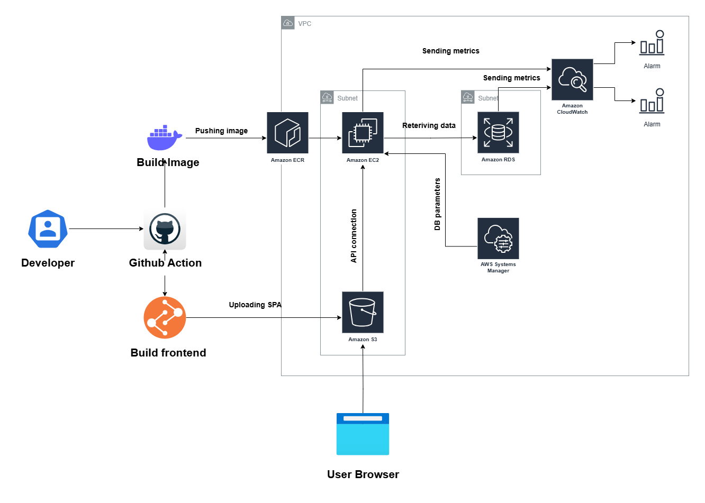

# Junior DevOps Case Study

This project demonstrates a production-ready deployment of a **Django + PostgreSQL** backend with **Nginx** as a reverse proxy, containerized via **Docker Compose**, and provisioned on **AWS** using **Terraform**. It includes automation for seeding initial data and integrates logging and monitoring with **CloudWatch**.

---

## Project Overview

- **Backend:** Django application (Dockerized).
- **Frontend:** Static site hosted on S3.
- **Reverse Proxy:** Nginx container.
- **Database:** AWS RDS PostgreSQL.
- **Infrastructure as Code:** Terraform for VPC, subnets, EC2, RDS, S3, IAM, CloudWatch, etc.
- **Secrets Management:** AWS SSM Parameter Store.
- **Logging:** CloudWatch log groups for Nginx and Django.
- **Deployment:** GitHub Actions builds & deploys containers from ECR to EC2, syncs frontend to S3.
- **Seeding:** Bash script inserts seed values into PostgreSQL.

---

## Dependencies

- **Python**: 3.10.12  
- **Django**: >=5.0,<6.0  
- **psycopg2-binary**: >=2.9  
- **gunicorn**: >=21.0  
- **django-cors-headers**: >=4.0  
- **PostgreSQL**: 15
- **Node**: 18

## Prerequisites

- [Terraform >= 1.5](https://developer.hashicorp.com/terraform/downloads)
- [Docker & Docker Compose](https://docs.docker.com/get-docker/)
- [AWS CLI v2](https://docs.aws.amazon.com/cli/latest/userguide/getting-started-install.html)
- GitHub Actions configured with required secrets:
  - `AWS_ROLE_ARN`
  - `EC2_HOST`
  - `EC2_SSH_KEY`
  - `EC2_USER`
  - `S3_BUCKET_NAME`

- GitHub Actions configured with following variables:
  - `AWS_REGION`
  - `ECR_REPOSITORY`
  - `PROJECT_NAME`
---

## Architecture Diagram
Following is the infrastructure diagram for our Single Page Application (SPA) deployment on AWS.



## Setup Instructions

- **Clone the repository**
  ```bash
  git clone <repo-url>
  cd DevOps-case-study
  ```

- **Deploy infrastructure using Terraform from the terminal**
  ```bash
  terraform init
  terraform apply -auto-approve
  ```
- **Make required changes in the code (Update application files as needed) then push changes to the main branch**

  ```bash
  git add .
  git commit -m "Your message"
  git push origin main
  ```

## Teardown / Cleanup

- Empty the S3 bucket  
- Delete all images from the ECR repository  
- Run `terraform destroy` to remove all infrastructure  


The run guide is present in ```deploy.md``` and ```rollback.md``` contains the rollback strategy.

# Terraform Docs
Following are few of the information about the resources, inputs and outputs used in the infrastructure of this project.

# Tfvars Variables to be provided
Following are two variables that's need to be provided.
  - github_org (GitHub organization or user that owns the repository)
  - github_repo (GitHub repository name)

<!-- BEGIN_TF_DOCS -->
## Requirements

| Name | Version |
|------|---------|
| <a name="requirement_terraform"></a> [terraform](#requirement\_terraform) | >= 1.5.0 |
| <a name="requirement_aws"></a> [aws](#requirement\_aws) | ~> 5.0 |

## Providers

| Name | Version |
|------|---------|
| <a name="provider_aws"></a> [aws](#provider\_aws) | 5.100.0 |
| <a name="provider_local"></a> [local](#provider\_local) | 2.5.3 |
| <a name="provider_random"></a> [random](#provider\_random) | 3.7.2 |
| <a name="provider_tls"></a> [tls](#provider\_tls) | 4.1.0 |

## Modules

No modules.

## Inputs

| Name | Description | Type | Default | Required |
|------|-------------|------|---------|:--------:|
| <a name="input_aws_region"></a> [aws\_region](#input\_aws\_region) | AWS region where all resources will be created | `string` | `"us-west-1"` | no |
| <a name="input_db_username"></a> [db\_username](#input\_db\_username) | Master username for the PostgreSQL database | `string` | `"appuser"` | no |
| <a name="input_environment"></a> [environment](#input\_environment) | Environment identifier (e.g., dev, staging, production) | `string` | `"production"` | no |
| <a name="input_github_org"></a> [github\_org](#input\_github\_org) | GitHub organization or user that owns the repository | `string` | n/a | yes |
| <a name="input_github_repo"></a> [github\_repo](#input\_github\_repo) | GitHub repository name used in CI/CD pipeline | `string` | n/a | yes |
| <a name="input_image_tag"></a> [image\_tag](#input\_image\_tag) | Docker image tag for the backend service (default: latest) | `string` | `"latest"` | no |
| <a name="input_project_name"></a> [project\_name](#input\_project\_name) | Name prefix for project resources | `string` | `"junior-devops-case-study"` | no |

## Resources

| Name | Type |
|------|------|
| [aws_cloudwatch_dashboard.main](https://registry.terraform.io/providers/hashicorp/aws/latest/docs/resources/cloudwatch_dashboard) | resource |
| [aws_cloudwatch_log_group.django_app](https://registry.terraform.io/providers/hashicorp/aws/latest/docs/resources/cloudwatch_log_group) | resource |
| [aws_cloudwatch_log_group.nginx](https://registry.terraform.io/providers/hashicorp/aws/latest/docs/resources/cloudwatch_log_group) | resource |
| [aws_cloudwatch_metric_alarm.database_cpu](https://registry.terraform.io/providers/hashicorp/aws/latest/docs/resources/cloudwatch_metric_alarm) | resource |
| [aws_cloudwatch_metric_alarm.high_cpu](https://registry.terraform.io/providers/hashicorp/aws/latest/docs/resources/cloudwatch_metric_alarm) | resource |
| [aws_db_instance.postgres](https://registry.terraform.io/providers/hashicorp/aws/latest/docs/resources/db_instance) | resource |
| [aws_db_subnet_group.default](https://registry.terraform.io/providers/hashicorp/aws/latest/docs/resources/db_subnet_group) | resource |
| [aws_ecr_repository.backend](https://registry.terraform.io/providers/hashicorp/aws/latest/docs/resources/ecr_repository) | resource |
| [aws_iam_instance_profile.ec2_instance_profile](https://registry.terraform.io/providers/hashicorp/aws/latest/docs/resources/iam_instance_profile) | resource |
| [aws_iam_instance_profile.ec2_profile](https://registry.terraform.io/providers/hashicorp/aws/latest/docs/resources/iam_instance_profile) | resource |
| [aws_iam_openid_connect_provider.github](https://registry.terraform.io/providers/hashicorp/aws/latest/docs/resources/iam_openid_connect_provider) | resource |
| [aws_iam_policy.cloudwatch_logs_policy](https://registry.terraform.io/providers/hashicorp/aws/latest/docs/resources/iam_policy) | resource |
| [aws_iam_policy.github_actions](https://registry.terraform.io/providers/hashicorp/aws/latest/docs/resources/iam_policy) | resource |
| [aws_iam_role.ec2_cloudwatch_role](https://registry.terraform.io/providers/hashicorp/aws/latest/docs/resources/iam_role) | resource |
| [aws_iam_role.ec2_role](https://registry.terraform.io/providers/hashicorp/aws/latest/docs/resources/iam_role) | resource |
| [aws_iam_role.github_actions](https://registry.terraform.io/providers/hashicorp/aws/latest/docs/resources/iam_role) | resource |
| [aws_iam_role_policy_attachment.ec2_cloudwatch_attach](https://registry.terraform.io/providers/hashicorp/aws/latest/docs/resources/iam_role_policy_attachment) | resource |
| [aws_iam_role_policy_attachment.github_actions](https://registry.terraform.io/providers/hashicorp/aws/latest/docs/resources/iam_role_policy_attachment) | resource |
| [aws_instance.app](https://registry.terraform.io/providers/hashicorp/aws/latest/docs/resources/instance) | resource |
| [aws_internet_gateway.gw](https://registry.terraform.io/providers/hashicorp/aws/latest/docs/resources/internet_gateway) | resource |
| [aws_key_pair.case_study_key_pair](https://registry.terraform.io/providers/hashicorp/aws/latest/docs/resources/key_pair) | resource |
| [aws_route_table.public](https://registry.terraform.io/providers/hashicorp/aws/latest/docs/resources/route_table) | resource |
| [aws_route_table_association.a](https://registry.terraform.io/providers/hashicorp/aws/latest/docs/resources/route_table_association) | resource |
| [aws_route_table_association.b](https://registry.terraform.io/providers/hashicorp/aws/latest/docs/resources/route_table_association) | resource |
| [aws_s3_bucket.frontend](https://registry.terraform.io/providers/hashicorp/aws/latest/docs/resources/s3_bucket) | resource |
| [aws_s3_bucket_acl.frontend](https://registry.terraform.io/providers/hashicorp/aws/latest/docs/resources/s3_bucket_acl) | resource |
| [aws_s3_bucket_ownership_controls.frontend](https://registry.terraform.io/providers/hashicorp/aws/latest/docs/resources/s3_bucket_ownership_controls) | resource |
| [aws_s3_bucket_policy.frontend](https://registry.terraform.io/providers/hashicorp/aws/latest/docs/resources/s3_bucket_policy) | resource |
| [aws_s3_bucket_public_access_block.frontend](https://registry.terraform.io/providers/hashicorp/aws/latest/docs/resources/s3_bucket_public_access_block) | resource |
| [aws_s3_bucket_website_configuration.frontend](https://registry.terraform.io/providers/hashicorp/aws/latest/docs/resources/s3_bucket_website_configuration) | resource |
| [aws_security_group.db_sg](https://registry.terraform.io/providers/hashicorp/aws/latest/docs/resources/security_group) | resource |
| [aws_security_group.ec2_sg](https://registry.terraform.io/providers/hashicorp/aws/latest/docs/resources/security_group) | resource |
| [aws_ssm_parameter.database_host](https://registry.terraform.io/providers/hashicorp/aws/latest/docs/resources/ssm_parameter) | resource |
| [aws_ssm_parameter.database_name](https://registry.terraform.io/providers/hashicorp/aws/latest/docs/resources/ssm_parameter) | resource |
| [aws_ssm_parameter.database_password](https://registry.terraform.io/providers/hashicorp/aws/latest/docs/resources/ssm_parameter) | resource |
| [aws_ssm_parameter.database_url](https://registry.terraform.io/providers/hashicorp/aws/latest/docs/resources/ssm_parameter) | resource |
| [aws_ssm_parameter.database_user](https://registry.terraform.io/providers/hashicorp/aws/latest/docs/resources/ssm_parameter) | resource |
| [aws_ssm_parameter.django_secret_key](https://registry.terraform.io/providers/hashicorp/aws/latest/docs/resources/ssm_parameter) | resource |
| [aws_ssm_parameter.ecr_image_tag](https://registry.terraform.io/providers/hashicorp/aws/latest/docs/resources/ssm_parameter) | resource |
| [aws_ssm_parameter.ecr_repo_url](https://registry.terraform.io/providers/hashicorp/aws/latest/docs/resources/ssm_parameter) | resource |
| [aws_ssm_parameter.region](https://registry.terraform.io/providers/hashicorp/aws/latest/docs/resources/ssm_parameter) | resource |
| [aws_subnet.public_a](https://registry.terraform.io/providers/hashicorp/aws/latest/docs/resources/subnet) | resource |
| [aws_subnet.public_b](https://registry.terraform.io/providers/hashicorp/aws/latest/docs/resources/subnet) | resource |
| [aws_vpc.main](https://registry.terraform.io/providers/hashicorp/aws/latest/docs/resources/vpc) | resource |
| [local_file.private_key](https://registry.terraform.io/providers/hashicorp/local/latest/docs/resources/file) | resource |
| [random_password.db_password](https://registry.terraform.io/providers/hashicorp/random/latest/docs/resources/password) | resource |
| [tls_private_key.case_study_key](https://registry.terraform.io/providers/hashicorp/tls/latest/docs/resources/private_key) | resource |
| [aws_iam_policy_document.ec2_assume](https://registry.terraform.io/providers/hashicorp/aws/latest/docs/data-sources/iam_policy_document) | data source |

## Outputs

| Name | Description |
|------|-------------|
| <a name="output_cloudwatch_dashboard_url"></a> [cloudwatch\_dashboard\_url](#output\_cloudwatch\_dashboard\_url) | CloudWatch dashboard URL for monitoring EC2 and RDS metrics |
| <a name="output_db_endpoint"></a> [db\_endpoint](#output\_db\_endpoint) | RDS PostgreSQL database endpoint |
| <a name="output_db_host"></a> [db\_host](#output\_db\_host) | Database host endpoint for PostgreSQL |
| <a name="output_ec2_public_ip"></a> [ec2\_public\_ip](#output\_ec2\_public\_ip) | Public IP address of the EC2 application server |
| <a name="output_ecr_repository_url"></a> [ecr\_repository\_url](#output\_ecr\_repository\_url) | ECR repository URL for pushing and pulling backend images |
| <a name="output_github_actions_role_arn"></a> [github\_actions\_role\_arn](#output\_github\_actions\_role\_arn) | IAM role ARN used by GitHub Actions for deployments |
| <a name="output_s3_website_endpoint"></a> [s3\_website\_endpoint](#output\_s3\_website\_endpoint) | S3 static website endpoint (auto-generated by AWS) |
| <a name="output_s3_website_url"></a> [s3\_website\_url](#output\_s3\_website\_url) | Public S3 website URL for the frontend application |
<!-- END_TF_DOCS -->